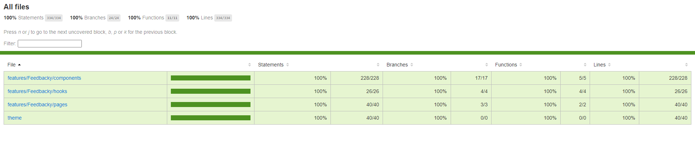
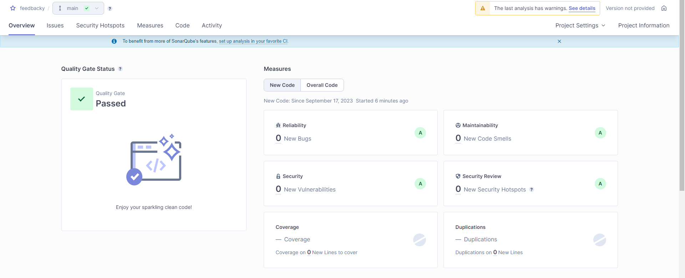

<div align="center">
<h1>Feedbacky</h1>

<a href="https://www.trendyol.com">
  
</a>

<p>A hiring case developed by Utku Alavanda.</p>
</div>

<hr />

## Table of Contents

<!-- START doctoc generated TOC please keep comment here to allow auto update -->
<!-- DON'T EDIT THIS SECTION, INSTEAD RE-RUN doctoc TO UPDATE -->

- [The Purpose](#the-purpose)
- [Online Demo](#online-demo)
- [Running The Application](#running-the-application)
- [Running The Application With Docker](#running-the-application-with-docker)
- [Google Sheets](#google-sheets)
- [Unit Testing Coverage](#unit-testing-coverage)
- [SonarQube Result](#sonarqube-result)

<!-- END doctoc generated TOC please keep comment here to allow auto update -->

## The Purpose

Let’s imagine that you’ve decided to build a start-up and that you have a great idea, which is a feedback system that enables customers to give feedback on e-commerce websites. You are both the founder and technical chief of your startup.

## Online Demo

```
https://feedbacky-app-alavanda.vercel.app/
```

## Running The Application

```
npm install -g yarn
```
```
yarn
```
```
yarn dev
```
## Running The Application With Docker

```
docker build -t feedbacky-image .
```
```
docker run -p 5173:5173 -d feedbacky-image
```

## Google Sheets

The Google Sheets which has been used for storage :

```
https://docs.google.com/spreadsheets/d/1lUD0_gLjW8VuoPpbHi0wZLSC7bH4t1yoFPdVsqwxZhc/edit?usp=sharing
```

## Unit Testing Coverage

Test coverage report path 'coverage/index.html'.



## SonarQube Result


